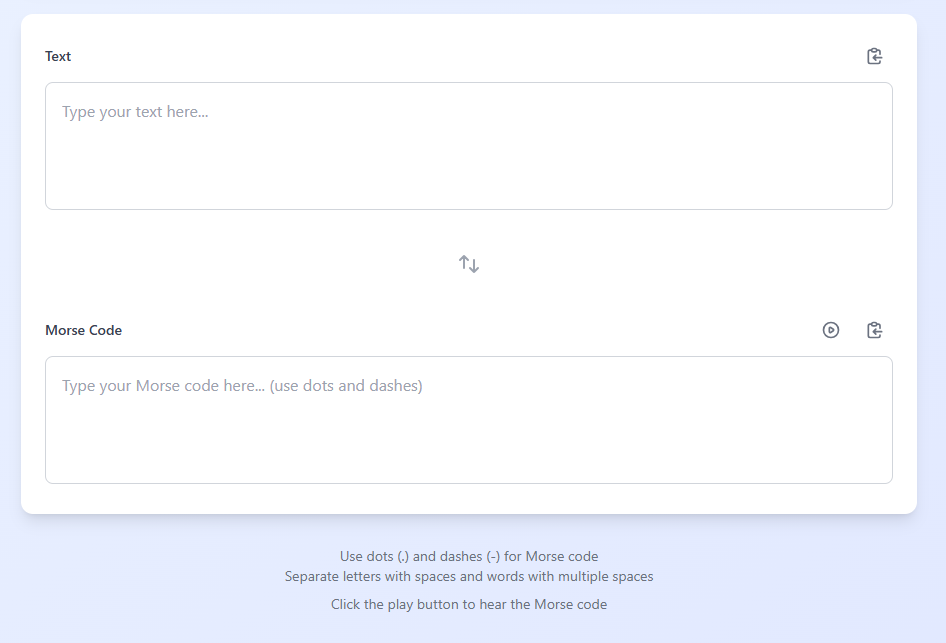
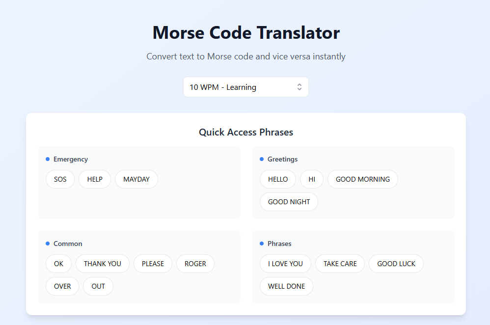

# Morse Code Translator 📟

A modern **Morse Code Translator** web app built with **React** and **Tailwind CSS**. This app provides an interactive, client-side experience for bidirectional Morse code translation with audio playback and enhanced user features.

---

## Features ✨

- **Real-Time Bidirectional Translation**:  
  Convert text to Morse code and vice versa instantly.  

- **Audio Playback**:  
  - Hear the Morse code with adjustable speed (Words Per Minute).  
  - Visual feedback during playback.  

- **Common Phrases Shortcuts**:  
  - Quick access to frequently used Morse code phrases.  

- **Copy to Clipboard**:  
  - Easily copy text or Morse code with one click.  

- **Enhanced UI**:  
  - Gradient backgrounds with responsive design.  
  - Hover effects and animations for better visual feedback.  

- **Code Organization**:  
  - Separate components and utilities for maintainable and clean code.  

- **Completely Client-Side**:  
  - No external APIs or databases required.

---

## Screenshots 📸

### Translator Interface  


### Common Phrases Section  


---

## Getting Started 🚀

### Installation

1. Clone the repository:
   ```bash
   git clone https://github.com/cdrcknt/morse-code-translator.git
   cd morse-code-translator
   ```

2. Install dependencies:
   ```bash
   npm install
   ```

3. Start the development server:
   ```bash
   npm run dev
   ```

4. Open your browser at [http://localhost:3000](http://localhost:3000).

---

## Usage 🖥️

1. Enter text or Morse code into the input field.
2. Use the **Translate** button to convert.
3. Play the Morse code audio with the **Play** button.
4. Adjust playback speed using the speed control dropdown.
5. Use common phrases shortcuts for quick access.
6. Copy results to the clipboard with the **Copy** button.

---

## Technologies Used 🛠️

- **React**: For dynamic user interfaces.
- **Tailwind CSS**: For modern, efficient styling.
- **Web Audio API**: For generating Morse code audio.
- **Vite**: For fast development and build processes.

---

## Developers 🤝

- **Cedric Kent Centeno**  
  GitHub: [cdrcknt](https://github.com/cdrcknt)

---

## License 📜

This project is licensed under the MIT License. See the [LICENSE](LICENSE) file for details.

---

## Feedback & Support 💬

Feel free to open an issue or submit a pull request if you have ideas for improvement!

---
